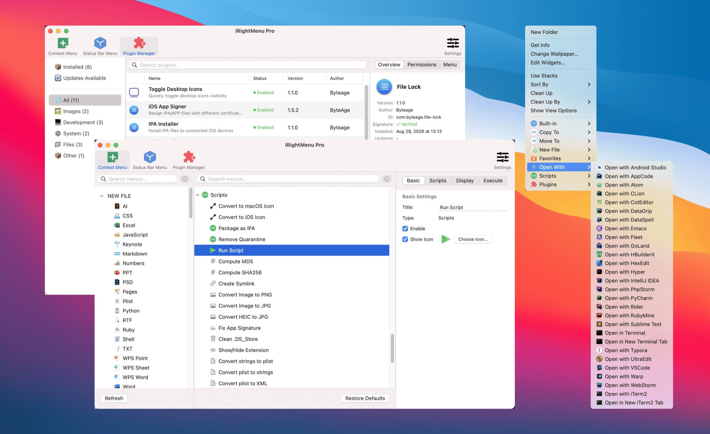
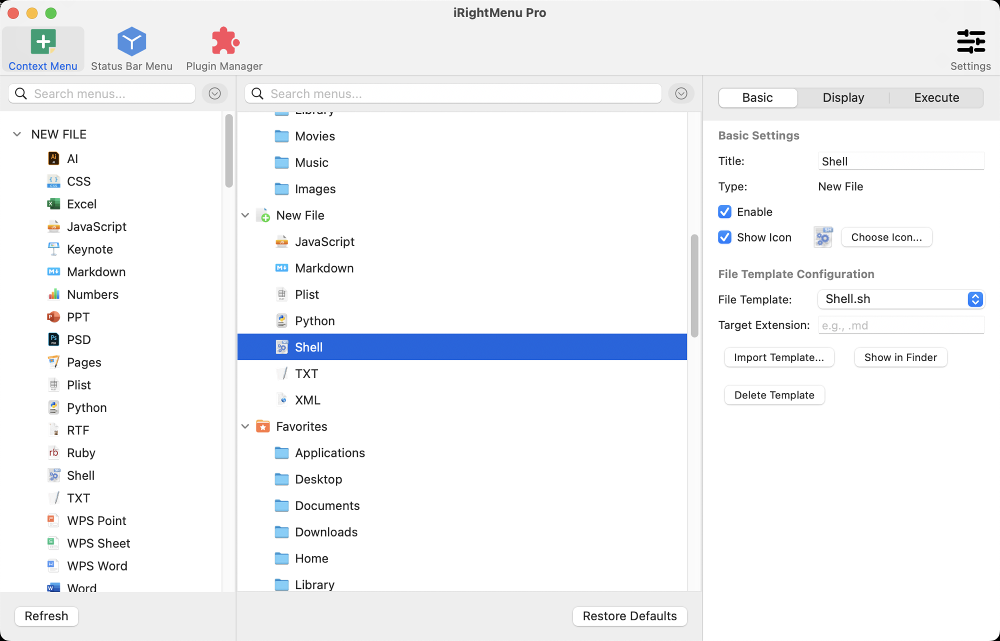
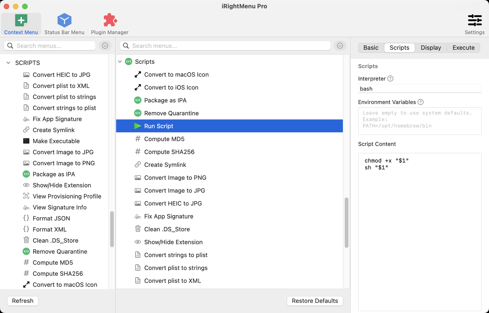

  

<h1 align="center">iRightMenu Pro</h1>

  <b>The right-click menu your Mac deserves.</b> 
  Everything macOS left out, one right-click away.

  <a href="https://rm.byteage.com/en/download"><b>Download</b></a> ·
  <a href="https://rm.byteage.com/en">Website</a> ·
  <a href="https://rm.byteage.com/en/pricing">Pricing</a> ·
  <a href="https://rm.byteage.com/en/docs/getting-started">User Guide</a> ·
  <a href="README_CN.md">中文</a>

iRightMenu Pro is commercial software, not open source. This repository is its product page and issue tracker — there's no source code here.

https://github.com/user-attachments/assets/43c2e4cc-1f17-442a-acb7-85303b07eb2a

  

## Everyday Essentials

- **New File** — Create Word, Excel, Markdown, Python and other files right from the context menu (21 formats), or use your own templates
- **Open With** — Open folders in Terminal, iTerm2, VS Code and more in one click — over 20 tools in all
- **Fix "damaged" apps** — Downloaded app won't open? Right-click to remove the quarantine flag
- **File tasks** — Convert HEIC to JPG, compute MD5, copy paths, save clipboard screenshots as PNG, and more
- **Copy To · Move To · Favorites** — Get to the folders you use most in one step

  

## Power Features

- **Any script as a menu item** — Bash, Python, Ruby, AppleScript and more, with the selected files passed in; scripts that need root run too, and Shortcuts can be triggered
- **Lua plugins** — One-click installs from the plugin store, or write your own: the API covers files, HTTP, dialogs, Bluetooth, window management and more
- **Visual menu editor** — Drag and drop to design your menu, with submenus, conditional display and custom icons
- **Works in cloud and system folders** — iCloud Drive, OneDrive, Dropbox and other folders where regular Finder extensions don't work; retry as administrator when permissions fall short
- **Status Bar Menu** — Put your favorite items in the menu bar, no right-click needed
- **iCloud backup** — Back up configurations, templates and plugins to iCloud, optionally every day, and restore on a new Mac in one click

  

## Download & Pricing

- Requires macOS 11 or later
- [Download from the website](https://rm.byteage.com/en/download)
- Monthly or lifetime, same features — [see pricing](https://rm.byteage.com/en/pricing)

## Feedback

This repository collects bug reports and feature requests for iRightMenu Pro.

### Bug Reports

Please use the [Bug Report](../../issues/new?template=bug_report.yml) template and include:

- macOS version, iRightMenu Pro version (Settings → About), and where you installed it from (website or App Store)
- Steps to reproduce
- Expected vs actual behavior
- Screenshots or screen recordings (if applicable)
- Logs (Settings → Diagnostics → Open Log Folder)

### Feature Requests

Please use the [Feature Request](../../issues/new?template=feature_request.yml) template to describe the feature and your use case.

### Before Submitting

- [Search existing issues](../../issues) to avoid duplicates
- Chinese or English are both fine
- Do not include activation codes or license keys
- For plugin development questions, see the [Plugin Developer Guide](https://rm.byteage.com/en/docs/guide)

## Contact

Email **support@byteage.com**

## Links

- [Website](https://rm.byteage.com/en)
- [User Guide](https://rm.byteage.com/en/docs/getting-started)
- [Plugin Developer Guide](https://rm.byteage.com/en/docs/guide)
- [Changelog](https://rm.byteage.com/en/changelog)
- [Download](https://rm.byteage.com/en/download)
